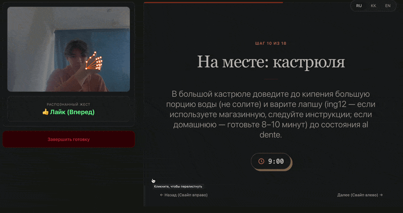
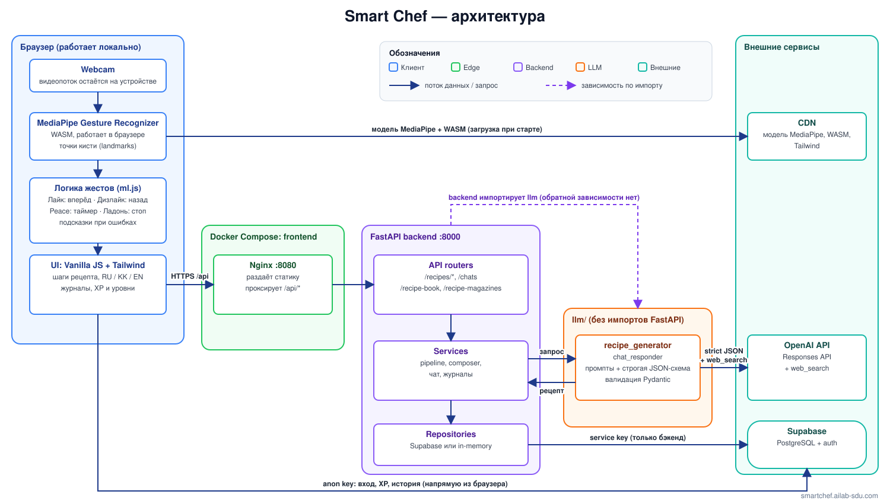

# 🧑‍🍳 Smart Chef

Веб-приложение, которое генерирует рецепт по свободному запросу и позволяет проходить его пошагово **жестами перед веб-камерой**, не касаясь экрана грязными руками.



Проект создан на хакатоне ADMIT HACKATHON (тема «MOTION: камера вместо джойстика»).

## Проблема и решение

Во время готовки руки заняты или испачканы, а рецепт приходится листать на телефоне или ноутбуке. Smart Chef получает от LLM структурированный рецепт и показывает его по одному шагу на экране. Шаги и таймеры переключаются четырьмя жестами, которые распознаются прямо в браузере.

## Возможности

| Возможность | Статус | Детали |
|---|---|---|
| Управление жестами | ✅ | 4 жеста, распознавание в браузере (MediaPipe) |
| Подсказки об ошибках жестов | ✅ | Конкретные сообщения для Лайка и Peace, общее сообщение для неизвестного жеста ([см. ниже](#управление-жестами)) |
| Генерация рецептов через LLM | ✅ | OpenAI Responses API, строгая JSON-схема, веб-поиск |
| Чат для уточнения рецепта | ✅ | `/chats`, контракт в [docs/chat_contract.md](docs/chat_contract.md) |
| Книга рецептов | ✅ | Supabase или хранилище в памяти процесса |
| Кулинарные журналы | ✅ | Сборка, публикация, поиск и сортировка на витрине ([контракт](docs/recipe_magazine_contract.md)) |
| Уровни и XP | ✅ | 10 уровней, 20 XP за шаг; прогресс хранится в Supabase |
| Интерфейс на 3 языках | ✅ | Русский, казахский, английский |
| Голосовой таймер через Алису | ✅ MVP | Приватный навык, привязка по короткому коду ([настройка](docs/yandex_alice_integration.md)) |
| 3D-перелистывание, звуки, конфетти | ✅ | Web Audio API, `canvas-confetti` |
| Смена LLM-провайдера в одну строку | 🚧 | Только во вложенном `recipe-ai-backend/` (LangChain). Корневой бэкенд использует OpenAI SDK |

## Демо

Живая версия: https://smartchef.ailab-sdu.com/

Локальный запуск через Docker описан в [быстром старте](#быстрый-старт). Пример работы: GIF выше.

## Архитектура



Зависимость однонаправленная: `backend` импортирует `llm`, но не наоборот.

```
backend/                 FastAPI: api/ (тонкие роуты), services/, repositories/, schemas/, tests/
llm/                     Всё про модель: prompts/, recipe_generator.py, schemas.py, config.py, tests/
js/                      Фронтенд: ml.js (жесты), ui.js, i18n.js, auth.js, magazine.js, audio.js
css/, index.html         Интерфейс (без сборки)
docs/                    Контракты API (рецепт, чат, журналы) и demo.gif
deploy/                  nginx.conf и api-config.js для Docker
scripts/                 smoke_docker.py — проверка запущенного стека
recipe-ai-backend/       Более ранняя LangChain-версия бэкенда, без журналов; в Docker не собирается
hand-tracking-sandbox/   Отдельная песочница для экспериментов с трекингом рук
```

## Стек

| Слой | Технология | Зачем |
|---|---|---|
| Frontend | Vanilla JS, HTML5, Tailwind (CDN) | Интерфейс без этапа сборки |
| Жесты | MediaPipe Tasks Vision 0.10.18 | Распознавание руки в браузере |
| Звук, эффекты | Web Audio API, canvas-confetti | Звуки без внешних файлов, конфетти |
| Backend | Python ≥ 3.12, FastAPI, Uvicorn | Асинхронный HTTP API |
| LLM | OpenAI SDK (Responses API) | Генерация рецептов со строгой схемой |
| Валидация | Pydantic v2 | Проверка JSON-ответа модели |
| Хранение | Supabase (PostgreSQL) | Аккаунты, XP, книга рецептов, журналы |
| Качество | pytest, ruff, mypy | Тесты, линтер, типы |

## Быстрый старт

Требования: Docker Engine/Desktop с Compose v2 **или** Python ≥ 3.12 и Node.js. Нужен ключ OpenAI и доступ в интернет (CDN, модель MediaPipe, OpenAI).

### Вариант A: Docker

```bash
test -f .env || cp .env.example .env   # затем впишите OPENAI_API_KEY
docker compose up --build -d --wait
```

- Интерфейс: http://localhost:8080
- Документация API: http://localhost:8000/docs
- Проверка стека: `python3 scripts/smoke_docker.py`

Подробности, порты и деплой на сервер: [DEPLOYMENT.md](DEPLOYMENT.md).

### Вариант B: локально

Команды выполняются из корня репозитория.

```bash
python -m venv .venv
source .venv/bin/activate            # Windows: .venv\Scripts\activate
pip install -e .
cp .env.example .env                 # впишите OPENAI_API_KEY
python -m uvicorn backend.main:app --host 0.0.0.0 --port 8000
```

В новом терминале:

```bash
npx serve -l 8080
```

Откройте http://localhost:8080 и разрешите доступ к камере. Камера работает на `localhost` и на HTTPS.

## Конфигурация

Переменные читаются из `.env` (шаблон: [.env.example](.env.example)).

| Переменная | Обязательна | По умолчанию | Описание |
|---|---|---|---|
| `OPENAI_API_KEY` | да | — | Ключ OpenAI |
| `OPENAI_MODEL` | да | `gpt-6-luna` в `.env.example` | Модель для генерации рецептов |
| `OPENAI_TIMEOUT_SECONDS` | нет | `60` | Таймаут запроса к модели |
| `TWO_STEP_MODE` | нет | `false` | Запасной режим: поиск и текст, затем конвертация в строгий JSON |
| `OPENAI_PRICING_MODEL` и тарифы | нет | GPT-6 Luna Standard short-context | Оценка стоимости в JSON-логах ([инструкция](docs/api_cost_logging.md)) |
| `SUPABASE_URL` | нет | пусто | Адрес проекта Supabase для хранения на бэкенде |
| `SUPABASE_SERVICE_KEY` | нет | пусто | Service role key (не anon), только для бэкенда |
| `YANDEX_ALICE_SKILL_ID` | нет | пусто | ID навыка для проверки входящих webhook-запросов Алисы |

Если `SUPABASE_*` не заданы, книга рецептов и журналы хранятся в памяти процесса и пропадают при перезапуске. Чтобы включить постоянное хранение, выполните SQL-миграцию из [docs/recipe_magazine_contract.md](docs/recipe_magazine_contract.md) в SQL-редакторе Supabase.

Есть и необязательные настройки чата (`REVISE_MODEL`, `REVISE_USE_WEB_SEARCH`, `REVISE_HISTORY_MESSAGES`, `REVISE_FALLBACK_TO_FULL_REGENERATION`), см. [llm/config.py](llm/config.py).

## Управление жестами

Базовую классификацию даёт MediaPipe, поверх неё [js/ml.js](js/ml.js) проверяет качество жеста по координатам точек кисти. Между срабатываниями действует пауза 1,5 с.

| Жест | Действие | Дополнительная проверка | Сообщение при ошибке |
|---|---|---|---|
| 👍 Лайк | Следующий шаг | Средний, безымянный и мизинец согнуты (кончик ближе к запястью, чем основание пальца) | «Сожмите остальные пальцы в кулак, чтобы распознать жест "Лайк"» |
| 👎 Дизлайк | Предыдущий шаг | нет | нет |
| ✌️ Peace | Запустить таймер | Расстояние между кончиками указательного и среднего пальцев ≥ 0,045 (в нормализованных координатах) | «Пальцы слишком близко! Раздвиньте указательный и средний пальцы шире…» |
| ✋ Открытая ладонь | Остановить таймер | нет | нет |
| Любой другой жест (кулак, непонятная поза) | Ничего | — | «Жест непонятный! Покажите жест четче (Лайк, Дизлайк или Peace).» |

Так реализовано требование хакатона об осмысленных сообщениях об ошибках: система различает «жест понят, но выполнен неверно» и «жест не входит в набор», а не отвечает одним общим текстом. Ошибка показывается 2 секунды.

## API

Полная интерактивная документация: `/docs` (Swagger).

| Метод и путь | Назначение |
|---|---|
| `POST /recipes/create` | Полный конвейер: запрос → готовый рецепт |
| `POST /recipes/generate-raw` | Сырой JSON от модели |
| `POST /recipes/compose` | Сборка итогового рецепта из сырого |
| `POST /chats`, `GET /chats`, `GET /chats/{id}` | Создание и чтение чатов |
| `POST /chats/{id}/messages` | Сообщение в чате (уточнение рецепта) |
| `POST /chats/{id}/confirm` | Сохранить рецепт в книгу |
| `GET /recipe-book`, `GET /recipe-book/{id}` | Книга рецептов |
| `/recipe-magazines/...` | Создание, редактирование, обложка, публикация, витрина (`/market`) |
| `/integrations/yandex-alice/...` | Привязка браузера, webhook навыка и получение голосовых команд |

Ошибки модели и внешних сервисов возвращаются с разными HTTP-статусами, контракты описаны в [docs/](docs/).

## Тесты и качество

```bash
pip install -e ".[dev]"
pytest -q
ruff check . && ruff format --check .
mypy backend llm
```

По последней записи в [REPORT.md](REPORT.md): 148 тестов проходят, mypy проходит по 58 файлам. 

## Команда и лицензия

| Участник | Роль |
|---|---|
| Майлыбай Алихан | Full-stack developer |
| Тлеубаев Ансар | AI engineer |
| Амир | DevOps engineer |
| Ақарыс Сансызбайұлы | ML engineer |

Сделано для ADMIT HACKATHON. Лицензия: [LICENSE](LICENSE).
